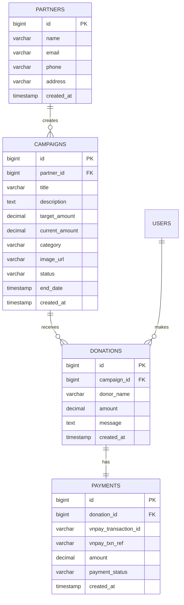

# Web Từ Thiện - Charity Platform

[](https://spring.io/projects/spring-boot)
[](https://www.oracle.com/java/)
[](https://www.postgresql.org/)
[](https://supabase.com/)

Nền tảng kết nối những tấm lòng hảo tâm với các hoàn cảnh khó khăn cần giúp đỡ. Hệ thống quản lý chiến dịch quyên góp minh bạch, hiệu quả với tích hợp thanh toán VNPay.

## 🌟 Tính năng chính

### Người dùng
- 🔐 Đăng ký/Đăng nhập tài khoản
- 🔍 Tìm kiếm và lọc chiến dịch theo danh mục
- 💰 Quyên góp qua VNPay
- 📊 Theo dõi tiến độ chiến dịch
- 📝 Để lại lời nhắn khi quyên góp

### Admin
- 👥 Quản lý người dùng
- 🎯 Quản lý chiến dịch (CRUD)
- 💵 Quản lý donations
- 🤝 Quản lý đối tác từ thiện
- 📈 Dashboard thống kê tổng quan
- 🖼️ Upload hình ảnh qua Supabase Storage

### Hệ thống
- 🔒 Bảo mật với Spring Security
- 💳 Tích hợp thanh toán VNPay
- ☁️ Lưu trữ trên Supabase (PostgreSQL + Storage)
- 🐳 Hỗ trợ Docker deployment
- 📱 Responsive design

## 🏗️ Kiến trúc

```
web_tu_thien/
├── src/main/
│   ├── java/org/example/webtuthien/
│   │   ├── config/          # Cấu hình Spring, Security, Database
│   │   ├── controller/      # REST & Web Controllers
│   │   ├── entity/          # JPA Entities
│   │   ├── repository/      # Spring Data JPA Repositories
│   │   ├── service/         # Business Logic
│   │   └── dto/             # Data Transfer Objects
│   │
│   ├── resources/
│   │   ├── templates/       # Thymeleaf HTML templates
│   │   │   ├── components/  # Reusable components
│   │   │   ├── admin/       # Admin pages
│   │   │   └── *.html       # Public pages
│   │   ├── static/
│   │   │   ├── css/         # Stylesheets
│   │   │   ├── js/          # JavaScript utilities
│   │   │   └── assets/      # Images, icons
│   │   ├── application.properties
│   │   ├── application-local.properties
│   │   └── schema-supabase-init.sql
│   │
├── docker-compose.yml       # Docker orchestration
├── Dockerfile              # Container definition
├── pom.xml                 # Maven dependencies
└── README.md
```

## 🛠️ Công nghệ sử dụng

### Backend
- **Spring Boot 3.x** - Application framework
- **Spring Data JPA** - Database ORM
- **Spring Security** - Authentication & Authorization
- **Thymeleaf** - Server-side template engine
- **PostgreSQL** - Relational database
- **Supabase** - Backend as a Service (Database + Storage)
- **HikariCP** - Connection pooling

### Frontend
- **HTML5/CSS3** - Markup & Styling
- **JavaScript (Vanilla)** - Client-side logic
- **Font Awesome 6** - Icons
- **Responsive Design** - Mobile-friendly

### Payment
- **VNPay** - Payment gateway integration

### DevOps
- **Docker** - Containerization
- **Docker Compose** - Multi-container orchestration
- **Maven** - Build automation

## 📋 Yêu cầu hệ thống

- **Java**: 17 hoặc cao hơn
- **Maven**: 3.6+
- **Docker**: 20.10+ (optional)
- **PostgreSQL**: 15+ (nếu không dùng Docker)

## 🚀 Cài đặt và Chạy

### 1. Clone repository

```bash
git clone <repository-url>
cd web_tu_thien
```

### 2. Cấu hình Supabase

#### Bước 2.1: Tạo Supabase project

1. Truy cập [Supabase Dashboard](https://supabase.com/dashboard)
2. Tạo project mới
3. Lưu lại các thông tin sau:

#### Bước 2.2: Lấy Database credentials

Vào **Settings** → **Database** và copy:
- **Host**: `db.xxxxxxxxxxxxx.supabase.co`
- **Database name**: `postgres`
- **Port**: `5432`
- **User**: `postgres.xxxxxxxxxxxxx`
- **Password**: (password bạn đã tạo khi setup project)

#### Bước 2.3: Lấy API credentials

Vào **Settings** → **API** và copy:
- **Project URL**: `https://xxxxxxxxxxxxx.supabase.co`
- **anon/public key**: `eyJhbGciOiJIUzI1NiIsInR5cCI6IkpXVCJ9...`
- **service_role key**: `eyJhbGciOiJIUzI1NiIsInR5cCI6IkpXVCJ9...` (bí mật, không commit)

### 3. Tạo file .env

Copy file mẫu và cập nhật với thông tin của bạn:

```bash
# Linux/Mac
cp .env.example .env

# Windows
copy .env.example .env
```
Cập nhật các giá trị trong `.env`:

```bash
# Database Configuration (from Supabase Dashboard → Settings → Database)
SPRING_DATASOURCE_URL=jdbc:postgresql://db.xxxxx.supabase.co:5432/postgres
SPRING_DATASOURCE_USERNAME=postgres.xxxxx
SPRING_DATASOURCE_PASSWORD=your-password-here

# API Configuration (from Supabase Dashboard → Settings → API)
SUPABASE_URL=https://xxxxx.supabase.co
SUPABASE_ANON_KEY=your-anon-key-here
SUPABASE_SERVICE_ROLE_KEY=your-service-role-key-here
```

### 4. Khởi tạo database schema

Chạy file SQL trong Supabase SQL Editor:

1. Vào Supabase Dashboard → **SQL Editor**
2. Tạo query mới
3. Copy nội dung từ `src/main/resources/schema-supabase-init.sql`
4. Run query

### 5. Chạy ứng dụng

#### Option A: Docker (Recommended)

```bash
# Linux/Mac
./docker-run.sh

# Windows
docker-run.bat
```

#### Option B: Local Development

```bash
# Set environment variables first (Linux/Mac)
export $(cat .env | grep -v '^#' | xargs)

# Windows PowerShell
Get-Content .env | ForEach-Object { if ($_ -match '^([^=]+)=(.*)$') { [Environment]::SetEnvironmentVariable($matches[1], $matches[2]) } }

# Run application
mvn spring-boot:run -Dspring-boot.run.profiles=local
```

### 6. Kiểm tra kết nối

```bash
# Health check
curl http://localhost:8080/health

# Database info
curl http://localhost:8080/api/health/db-info

# Supabase health
curl http://localhost:8080/api/supabase/health
```

Ứng dụng sẽ chạy tại: `http://localhost:8080`

## 👤 Tài khoản mặc định

### Admin
- **Username**: `admin`
- **Password**: `admin123`
- **URL**: `http://localhost:8080/admin/login`

## 📚 Cấu trúc Database

### Bảng chính

1. **users** - Người dùng hệ thống
2. **admins** - Quản trị viên
3. **partners** - Đối tác từ thiện
4. **campaigns** - Chiến dịch quyên góp
5. **donations** - Lịch sử quyên góp
6. **payments** - Giao dịch thanh toán VNPay

### Relationships

```
partners (1) ─────── (N) campaigns
campaigns (1) ─────── (N) donations
donations (1) ─────── (1) payments
```

## 🔐 Bảo mật

- Password hashing với BCrypt
- CSRF protection
- Session management
- Role-based access control (RBAC)
- SQL injection prevention (JPA)
- Row Level Security policies (Supabase)

## 📱 API Endpoints

### Public
- `GET /` - Trang chủ
- `GET /campaigns` - Danh sách chiến dịch
- `GET /campaign/{id}` - Chi tiết chiến dịch
- `GET /about` - Giới thiệu

### User (Authenticated)
- `POST /donate/{id}` - Quyên góp
- `GET /payment/callback` - VNPay callback

### Admin (Admin role)
- `GET /admin` - Dashboard
- `/admin/users` - Quản lý users
- `/admin/campaigns` - Quản lý campaigns
- `/admin/donations` - Quản lý donations
- `/admin/partners` - Quản lý partners

## 🔧 Cấu hình môi trường

### Profiles

- **local** - Development với Supabase
- **production** - Production deployment

### Environment Variables

```bash
SPRING_PROFILES_ACTIVE=local
SUPABASE_SERVICE_ROLE_KEY=your-key
VNPAY_TMN_CODE=your-code
VNPAY_HASH_SECRET=your-secret
```

## 🧪 Testing

```bash
# Run unit tests
mvn test

# Run with coverage
mvn test jacoco:report
```

## 📦 Build & Deploy

### Build JAR

```bash
mvn clean package -DskipTests
```

Output: `target/web_tu_thien-0.0.1-SNAPSHOT.jar`

### Docker Build

```bash
docker build -t web-tu-thien:latest .
docker run -p 8080:8080 web-tu-thien:latest
```

## 🌐 Deployment

### Docker Compose (Recommended)

```bash
docker-compose up -d
```

### Manual Deployment

1. Build JAR file
2. Upload to server
3. Set environment variables
4. Run: `java -jar web_tu_thien.jar --spring.profiles.active=local`

## 🚂 Deploy to Railway.app

### Prerequisites

1. **Railway Account**: Sign up at [railway.app](https://railway.app)
2. **Railway CLI**: 
   ```bash
   npm install -g @railway/cli
   ```

### Deployment Steps

#### 1. Login to Railway

```bash
railway login
```

#### 2. Create New Project

```bash
railway init
```

#### 3. Set Environment Variables

```bash
# Database (Supabase)
railway variables set SPRING_DATASOURCE_URL="jdbc:postgresql://db.gbzwqsyoihqtpcionaze.supabase.co:5432/postgres"
railway variables set SPRING_DATASOURCE_USERNAME="postgres.gbzwqsyoihqtpcionaze"
railway variables set SPRING_DATASOURCE_PASSWORD="zvBSwzV/@S8D?uvn"

# Supabase API
railway variables set SUPABASE_URL="https://gbzwqsyoihqtpcionaze.supabase.co"
railway variables set SUPABASE_ANON_KEY="your-anon-key"
railway variables set SUPABASE_SERVICE_ROLE_KEY="your-service-role-key"

# VNPay
railway variables set VNPAY_TMN_CODE="CGBU01D6"
railway variables set VNPAY_HASH_SECRET="GECKRBWVOKDDQSAEXBYNZFOJNPWSMXKV"
railway variables set VNPAY_RETURN_URL="https://your-app.railway.app/vnpay/return"

# Spring Profile
railway variables set SPRING_PROFILES_ACTIVE="production"
```

#### 4. Build and Deploy

```bash
# Build JAR
mvn clean package -DskipTests

# Deploy
railway up
```

Or use the deploy script:

```bash
chmod +x deploy-railway.sh
./deploy-railway.sh
```

#### 5. View Deployment

```bash
# View logs
railway logs

# Open in browser
railway open

# Get deployment URL
railway domain
```

### Railway Configuration

Railway automatically:
- ✅ Detects Dockerfile and builds image
- ✅ Assigns a public URL
- ✅ Provides SSL certificate
- ✅ Manages environment variables
- ✅ Auto-deploys on git push (if connected to GitHub)

### Environment Variables on Railway

Set these in Railway Dashboard or CLI:

| Variable | Description | Example |
|----------|-------------|---------|
| `SPRING_DATASOURCE_URL` | Supabase database URL | `jdbc:postgresql://db.xxx.supabase.co:5432/postgres` |
| `SPRING_DATASOURCE_USERNAME` | Database username | `postgres.xxx` |
| `SPRING_DATASOURCE_PASSWORD` | Database password | `your-password` |
| `SUPABASE_URL` | Supabase API URL | `https://xxx.supabase.co` |
| `SUPABASE_ANON_KEY` | Supabase anon key | `eyJ...` |
| `SUPABASE_SERVICE_ROLE_KEY` | Supabase service key | `eyJ...` |
| `VNPAY_TMN_CODE` | VNPay merchant code | `CGBU01D6` |
| `VNPAY_HASH_SECRET` | VNPay secret | `GECK...` |
| `VNPAY_RETURN_URL` | VNPay callback URL | `https://your-app.railway.app/vnpay/return` |

### Troubleshooting on Railway

#### Check Logs
```bash
railway logs --follow
```

#### Restart Service
```bash
railway restart
```

#### Check Build
```bash
railway status
```

#### Connect to Shell
```bash
railway shell
```

### Cost Estimate

Railway offers:
- **Free Tier**: $5 credit/month
- **Pro Plan**: $20/month + usage

Estimated cost for this app:
- **Hobby usage**: ~$3-5/month
- **Production**: ~$10-15/month

### Alternative: Connect GitHub

1. Push code to GitHub
2. Connect repository in Railway dashboard
3. Railway auto-deploys on push to main branch

```bash
git remote add origin https://github.com/yourusername/web_tu_thien.git
git push -u origin main
```

## 📊 Database Schema Diagram



## 🤝 Đóng góp

1. Fork repository
2. Tạo feature branch (`git checkout -b feature/AmazingFeature`)
3. Commit changes (`git commit -m 'Add some AmazingFeature'`)
4. Push to branch (`git push origin feature/AmazingFeature`)
5. Open Pull Request

## 📝 License

This project is licensed under the MIT License.

## 📧 Liên hệ

- **Email**: contact@webtuthien.vn
- **Phone**: 1900 1234
- **Address**: 123 Đường ABC, Quận 1, TP.HCM

## 🙏 Credits

- Spring Boot Team
- Supabase Team
- VNPay
- Font Awesome

---

**Made with ❤️ by Web Từ Thiện Team**
